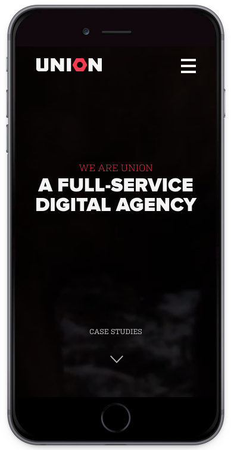

# vue-mobile-viewer

> Iframe with mobile viewer for vue applications or external web sites

[](https://badge.fury.io/js/vue-mobile-viewer)



# Install

## Vue project
```
npm install --save vue-mobile-viewer
```
## Usage
```
<template>
  <viewer :device="picked" :url="url"/>
</template>
import Viewer from 'vue-mobile-viewer'
export default {
  components: {
    Viewer
  },
  data: {
    return {
      url: 'https://union.co/',
      picked: 'android' //android or apple
    }
  }
}
```

## External page

### Android
```
<iframe src="https://brunofmeurer.github.io/vue-mobile-viewer/#/device?type=android&url=https%3A%2F%2Funion.co%2F"
    frameborder="0"
    scrolling="no"
    width="450px"
    height="850px"
    allowtransparency="yes"
/>
```

### IOS
```
<iframe src="https://brunofmeurer.github.io/vue-mobile-viewer/#/device?type=apple&url=https%3A%2F%2Funion.co%2F"
    frameborder="0"
    scrolling="no"
    width="450px"
    height="850px"
    allowtransparency="yes"
/>
```

## Credits
> I totally relied on a docs quasar api [QUASAR DOC](http://quasar-framework.org/components/toolbar.html)

## License
Copyright (c) 2018-present Bruno Meurer

[MIT License](http://en.wikipedia.org/wiki/MIT_License)